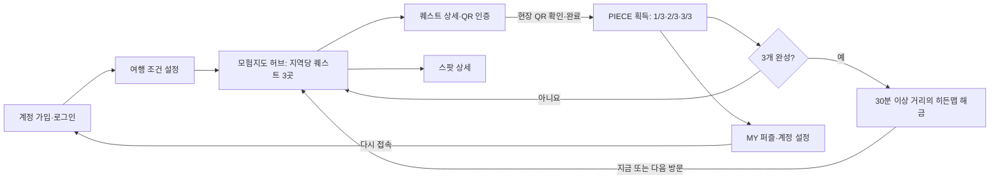
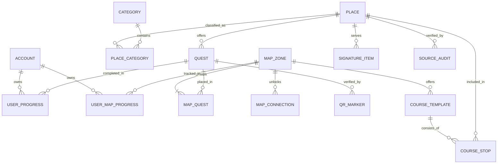

# 이천 모험지도 PRD
상태: 완료

> 내부 프로젝트명은 **One Piece 원피스: 이천**, 일반 공개 비상업 서비스명은 **이천 모험지도**다. 공개 서비스에는 독자적인 이름과 디자인을 사용하며 공식 캐릭터·로고·이미지는 사용하지 않는다.

## 1. 개요 및 배경 (Overview & Context)

### 제품명 / 프로젝트명

- 내부 프로젝트명: **One Piece 원피스: 이천**
- 공개 서비스명: **이천 모험지도**
- 공개 형태: 누구나 이용할 수 있는 비상업 웹 서비스

### 서비스 한 줄 소개

어린 자녀와 이천을 찾은 가족이 차량 10분 이내의 인근 스팟 3곳에서 현장 퀘스트를 수행해 퍼즐을 완성하고, 완료 지점에서 차량 30분 이상 떨어진 새로운 히든맵을 해금해 탐험을 이어가는 퀘스트형 여행 가이드다.

### 기획 배경 및 해결하려는 문제

- 이천의 관광 정보가 지도, 블로그, SNS, 관광 안내 사이트에 흩어져 있어 가족에게 맞는 장소를 조합하기 어렵다.
- 아동 동반 가족은 아이의 컨디션, 운영 시간, 이동 부담 때문에 현장에서 계획을 자주 바꿔야 한다.
- 기존 관광 코스는 장소 목록과 동선을 제공해도 아이가 다음 장소로 이동하고 싶게 만드는 참여 동기가 약하다.

### 타깃 사용자

- 만 3~10세 자녀와 자가용으로 이천을 방문하는 수도권 30~40대 가족 여행객
- 보호자는 주차·운영 시간·이동 부담을 빠르게 판단하고 싶고, 아이는 놀이처럼 여행에 참여하고 싶다.

### 현재 대체재

- 네이버 지도·카카오맵에서 장소를 검색하고 보호자가 직접 동선을 만든다.
- 블로그·SNS의 가족 나들이 후기를 조합한다.
- 이천시 문화관광 누리집의 추천 여행 코스를 참고한다.

## 2. 핵심 가치 및 유저 저니 (Core Value & User Journey)

### 핵심 가치 제안 (Value Proposition)

**“여행 계획을 따르는 아이”가 아니라 “퀘스트를 깨며 다음 여행지를 여는 아이”를 만든다.**

- 아이: 미션을 수행하고 퍼즐을 모으는 성취감으로 다음 장소 이동에 자발적으로 참여한다.
- 보호자: 한 맵 안에서 차량 10분 이내로 연결되는 3개 스팟을 따라가므로 가까운 장소를 다시 조합할 필요가 없다.
- 가족: 스팟 3곳의 퍼즐 조각을 모두 모으면 멀리 떨어진 새로운 지역의 히든맵이 열려 다음 탐험 목표가 생긴다.

### 코어 루프 (Core Loop)

`지역 맵 선택` → `10분 생활권의 퀘스트 3곳 방문` → `장소별 QR 인증·PIECE 1개 획득` → `3 PIECE로 지역 퍼즐 완성` → `30분 이상 떨어진 히든맵 해금` → `새 맵의 인근 퀘스트 3곳 진행`

### 대표 유저 저니

1. 보호자가 아이 연령, 사용 가능한 시간, 관심사를 선택하고 시작 지역 맵을 고른다.
2. 활성 맵에서 차량 이동 10분 이내로 묶인 퀘스트 스팟 3곳과 추천 방문 순서를 확인한다.
3. 첫 장소를 방문해 아이와 5~15분의 관찰·찾기 미션을 수행한다.
4. 현장 QR을 스캔해 퀘스트를 완료하고 해당 맵의 퍼즐 조각 1개를 얻는다.
5. 남은 두 장소에서도 같은 과정을 반복해 진행도를 `1/3 → 2/3 → 3/3`으로 채운다.
6. 세 번째 조각을 얻으면 지역 퍼즐이 완성되고, 차량 30분 이상 떨어진 지역의 히든맵이 활성화된다.
7. 새로 열린 맵에서도 차량 10분 이내의 퀘스트 스팟 3곳을 방문하며 같은 루프를 반복한다.

## 3. 기능 명세 및 우선순위 (Feature Specifications & Priority)

### P0 — Must Have

#### 3.1 직접 식별정보 없는 계정과 진행 복원

- 사용자는 서비스 전용 아이디 하나만 필수 입력해 계정을 등록하고 다시 접속할 수 있다.
- 가입과 로그인은 하나의 아이디 입력창을 사용한다. 입력한 아이디가 존재하면 즉시 로그인하고, 존재하지 않으면 '새 모험가 계정을 만들까요?' 확인 후에만 신규 계정과 빈 진행 상태를 생성한다.
- PIN과 비밀번호는 사용하지 않는다. 이메일은 가입 필수가 아니며 계정 복구를 원하는 사용자가 선택적으로 등록한다.
- 이름, 전화번호, 주소, 생년월일, 소셜 계정은 가입 항목으로 받지 않는다.
- 가입 화면에서 실명, 이메일 주소, 전화번호를 아이디로 사용하지 말라고 안내하고 이메일·전화번호 형식은 차단한다.
- 어느 기기에서든 등록된 아이디만 입력하면 완료 퀘스트, 지역별 퍼즐 조각, 완료 맵과 활성화된 히든맵을 즉시 복원한다. (보안 위험 이해 후 선택)
- 선택 이메일은 별도 동의를 받고 이메일 인증을 마친 뒤, 아이디를 잊었을 때 보내는 일회용 로그인 링크와 계정 복구에만 사용한다.
- 아이디를 아는 다른 사람도 진행 기록을 열고 변경할 수 있으며, 이메일 등록 여부와 관계없이 아이디 로그인 자체는 차단되지 않는다. (보안 위험 이해 후 선택)
- 이메일 등록 계정은 인증된 이메일 링크로 삭제를 확인한다. 이메일 미등록 계정은 가입 직후 발급된 별도 삭제 코드로 확인한다.
- 사용자는 위 확인을 거쳐 계정과 연결된 진행 기록을 직접 삭제할 수 있다.
- 필요한 이유: 브라우저 데이터가 지워지거나 다시 접속해도 장기간의 탐험 기록을 이어가기 위해 필요하다.

#### 3.2 인근 3개 퀘스트와 지역 퍼즐 완성

- 하나의 지역 맵은 서로 차량 이동 10분 이내로 연결되는 서로 다른 퀘스트 스팟 **정확히 3곳**으로 구성하고 방문 순서를 1→2→3으로 지정한다.
- 스팟별로 어린이가 5~15분 안에 수행할 수 있는 관찰·찾기형 퀘스트를 제공한다.
- 인증은 현장 QR 단독으로 수행한다. GPS 자동 인증은 사용하지 않는다.
- 현장 QR을 스캔해 퀘스트를 완료하면 해당 지역 퍼즐 조각 1개를 지급한다.
- 앞 순서의 퀘스트를 완료해야 다음 퀘스트를 인증할 수 있다. 같은 퀘스트를 반복해도 조각은 한 번만 지급하며 진행도는 `0/3`부터 `3/3`까지 표시한다.
- 세 장소를 모두 완료해야 해당 지역 퍼즐을 완성한 것으로 처리한다.
- 필요한 이유: 가까운 지역을 부담 없이 탐험하면서도 명확한 완주 목표를 제공한다.

#### 3.3 히든맵 해금과 반복 탐험

- 지역 퍼즐을 `3/3`으로 완성하면 지정된 3번째 퀘스트 장소에서 첫 장소까지 차량 이동 기준 30분 이상인 히든맵 1개를 활성화한다.
- 히든맵에도 차량 이동 10분 이내로 연결되는 퀘스트 스팟 3곳을 배치한다.
- 새 맵에서 다시 퍼즐 조각 3개를 모으면 다음 히든맵이 열리는 구조를 반복한다.
- 히든맵은 활성화 후 만료되거나 다시 잠기지 않으며, 사용자가 당일 이동하지 못해도 계정으로 다시 로그인해 다음 방문에서 이용할 수 있다.
- 남은 시간 안에 히든맵으로 이동하기 어려우면 해금만 처리하고 다음 방문 이용을 안내한다.
- 필요한 이유: 가까운 장소 3곳의 완주 경험을 이천의 다른 지역 탐험으로 자연스럽게 확장한다.

#### 3.4 스팟·코스 상세 정보

- 장소명, 주소, 사진, 운영 시간, 주차·화장실, 권장 연령, 예상 체류 시간, 출처와 확인일을 제공한다.
- 지역 맵 카드와 하단 여정 선택에는 보호자 결정용 3뱃지를 항상 표시한다: `차량합계○분` + `도보○m` + `유모차 가능/불가`.
- 총 예상 시간, 코스 난이도(쉬움·보통), 권장 연령을 맵 카드에 함께 표시한다.
- 길찾기는 외부 지도 앱으로 연결한다.
- 필요한 이유: 보호자가 다음 이동을 안전하게 결정하는 데 필요한 최소 정보다.

#### 3.5 공개 데이터·QR 운영

- 관리자 포털은 만들지 않되 장소, 출처, 지역 맵, 퀘스트, QR 상태를 버전 관리되는 배포 데이터로 입력·갱신할 수 있어야 한다.
- 맵 공개 전에 서로 다른 퀘스트 스팟 정확히 3곳, 1→2·2→3 각 차량 10분 이하, 히든맵 연결 30분 이상, 출처·검수 상태를 자동 검사한다.
- QR은 불투명 토큰으로 발급하고 활성·비활성·교체 상태를 관리한다.
- 스팟 또는 QR 하나가 중단돼 3/3 완주가 불가능하면 해당 맵의 신규 시작과 추가 QR 인증을 일시 중단하고 사유를 표시한다. 기존 진행 기록 조회는 유지하며 승인된 대체 스팟이 준비된 뒤에만 재공개한다.
- 계정 복구·삭제와 QR 인증의 오류는 별도 신규 화면을 늘리지 않고 해당 계정·QR 화면 안의 인라인 안내 또는 모달 상태로 제공한다.
- 필요한 이유: 운영자 화면이 없어도 공개 데이터의 정확성과 현장 QR의 지속 운영을 보장해야 한다.

### P1 — Should Have

#### 3.6 MY 퍼즐 지도와 완성도

- 획득한 퍼즐, 미획득 퍼즐, 전체 완성률을 보여준다.
- 퍼즐을 선택하면 획득 장소와 완료한 퀘스트를 확인한다.
- 필요한 이유: 하루 동안의 성취를 시각화하고 추가 탐험 동기를 만든다.

#### 3.7 도자기 인트로와 조각 맛보기

- 달항아리를 눌러 여행을 시작하고, 도자기가 부드러운 세 조각으로 나뉘어 퍼즐 수집 방식을 미리 보여준다.
- 핵심 연출은 2초 이내이며 모션 축소 환경에서는 즉시 완료 상태를 표시한다.
- 이 기능이 없어도 계정 가입부터 QR 퀘스트 코어 루프는 동작해야 한다.
- 필요한 이유: 이천 도자기와 퍼즐 수집을 연결하는 브랜드 첫인상을 제공하지만 핵심 인증·진행 기능과는 독립적이다.

### P2 — Could Have

#### 3.8 계절·축제 한정 히든 맵

- 특정 기간이나 축제 현장에서만 열리는 퀘스트와 퍼즐을 제공한다.
- 필요한 이유: 재방문 동기를 만들 수 있지만 콘텐츠 운영 비용이 있어 첫 출시에 필수는 아니다.

### 제외 범위

- 예약·결제, 입장권 판매
- 사용자 후기·평점·커뮤니티
- 실시간 교통·혼잡도를 반영한 정밀 경로 최적화
- 관광업체가 직접 콘텐츠를 등록하는 운영자 포털
- 숙박이 포함된 1박 2일 이상 일정
- 공식 라이선스 없는 기존 만화 캐릭터·로고·이미지 사용
- GPS 기반 위치 추적과 이동 경로 저장

## 4. 유저 스토리 및 수락 조건 (User Stories & Acceptance Criteria)

### US-00 계정 생성과 진행 복원 — P0

**[재방문 가족]으로서 이전 여행에서 모은 퍼즐과 열린 히든맵을 이어가기 위해 직접 식별정보 없이 계정을 만들고 로그인하고 싶다.**

- AC1: 가입 필수 입력란에는 서비스 전용 아이디만 표시되며 PIN·비밀번호·이름·전화번호·주소·생년월일을 요구하지 않는다.
- AC2: 이메일은 `복구 이메일 등록`을 선택한 경우에만 입력하며 필수 가입 조건으로 사용하지 않는다.
- AC3: 이미 사용 중인 아이디, 이메일 형식, 전화번호 형식의 아이디는 등록하지 않고 이유를 안내한다.
- AC4: 가입 완료 후 새 계정과 빈 모험 진행 상태가 함께 생성된다.
- AC5: 어느 기기에서든 등록된 아이디를 입력하면 추가 인증 없이 완료 퀘스트, 퍼즐 조각, 완료 맵과 활성 히든맵이 복원된다.
- AC6: 이메일을 등록한 사용자는 이메일로 받은 일회용 링크를 통해 아이디를 몰라도 계정에 접속할 수 있다.
- AC7: 선택 이메일은 새 기기 로그인·계정 복구 이외의 알림이나 홍보에 사용하지 않는다.
- AC8: 이메일 등록 계정은 인증 이메일 링크, 미등록 계정은 별도 삭제 코드를 통과해야 삭제를 실행한다.
- AC9: 삭제 코드 원문은 가입 직후 한 번만 표시하고 서버에는 검증용 단방향 해시만 저장한다.
- AC10: 이메일 미등록 사용자가 삭제 코드를 잃으면 서비스 운영자가 아이디만으로 코드를 재발급하지 않는다.
- AC11: 입력한 아이디가 존재하지 않으면 신규 생성 확인을 표시하며, 사용자가 취소하면 계정을 만들지 않고 입력 화면으로 돌아간다.

### US-01 시작 지역 맵 선택 — P0

**[아동 동반 보호자]로서 가까운 장소들을 효율적으로 방문하기 위해 가족 조건에 맞는 지역 맵을 고르고 싶다.**

- AC1: 아이 연령, 남은 시간, 관심사를 입력하면 선택 가능한 시작 지역 맵이 표시된다.
- AC2: 각 지역 맵에는 퀘스트 스팟 3곳, 추천 순서, 3뱃지(`차량합계○분`, `도보○m`, `유모차 가능/불가`), 총 예상 시간, 난이도, 권장 연령과 추천 이유가 표시된다.
- AC3: 같은 지역 맵의 지정 순서 1→2, 2→3 사이 기준 차량 이동 시간이 모두 10분 이하여야 활성화할 수 있다.
- AC4: 운영 종료 전에 세 퀘스트를 완료하기 어려운 맵에는 경고가 표시된다.

### US-02 장소 도착 및 퀘스트 완료 — P0

**[가족 여행객]으로서 미션을 수행한 성취를 남기기 위해 방문과 완료를 인증하고 싶다.**

- AC1: 앱이 등록된 현장 QR 코드를 인식하면 해당 스팟의 퀘스트 완료 화면이 열린다.
- AC2: 잘못되었거나 등록되지 않은 QR을 스캔하면 완료 처리하지 않고 오류 이유를 안내한다.
- AC3: 지정 순서보다 앞선 QR을 건너뛰어 스캔하면 완료 처리하지 않고 먼저 수행할 퀘스트를 안내한다.
- AC4: 완료 요청이 성공하면 해당 지역 퍼즐 조각이 한 개 지급되며 같은 퀘스트로 중복 지급되지 않는다.
- AC5: 완료 버튼을 누른 뒤 3초 이내 퍼즐 획득 애니메이션이 시작된다.
- AC6: 애니메이션이 끝나면 지역 퍼즐 진행도가 `1/3`, `2/3`, `3/3` 중 하나로 즉시 갱신된다.

### US-03 지역 퍼즐 완성과 히든맵 해금 — P0

**[가족 여행객]으로서 새로운 지역 탐험을 이어가기 위해 퀘스트 3곳을 완주하고 히든맵을 열고 싶다.**

- AC1: 같은 지역 맵에 등록된 서로 다른 퀘스트 3개를 완료해야 퍼즐이 완성된다.
- AC2: 세 번째 조각을 획득하면 히든맵 해금 연출과 새 지역의 이름·대표 이미지를 표시한다.
- AC3: 새 히든맵의 첫 장소는 완료한 맵의 지정된 3번째 퀘스트 장소에서 차량 이동 기준 30분 이상이어야 한다.
- AC4: 새 히든맵 역시 차량 이동 10분 이내의 퀘스트 스팟 정확히 3곳으로 구성한다.
- AC5: 해금된 맵은 만료되지 않으며 계정의 진행 상태에 저장해 다시 로그인한 뒤에도 이용할 수 있다.
- AC6: 남은 시간이 부족하면 즉시 이동을 요구하지 않고 `다음에 탐험하기`를 제공한다.

### US-04 MY 퍼즐 확인 — P1

**[아이와 보호자]로서 여행 성취를 함께 확인하기 위해 모은 퍼즐과 완성도를 보고 싶다.**

- AC1: 완료된 퀘스트마다 대응하는 퍼즐 조각이 한 번만 채워진다.
- AC2: 획득·미획득 조각과 전체 완성률이 구분되어 보인다.
- AC3: 퍼즐 조각을 선택하면 획득 장소와 퀘스트 이름이 표시된다.

## 5. UI/UX 및 데이터 요구사항 (UI/UX & Data Requirements)

### 주요 화면

- **주 사용 기기:** 모바일 웹 우선. 모든 화면은 세로형 스마트폰을 기준으로 설계하고, 태블릿·데스크톱에서는 모바일 캔버스를 중앙 정렬해 제공한다.

0. **선택 인트로·조각 맛보기(P1)** — 달항아리 시작과 세 조각 퍼즐 맛보기를 제공하며 생략돼도 가입·퀘스트 기능은 동작한다.
1. **계정·시작 설정** — 서비스 전용 아이디로 가입·로그인하고 아이 연령대, 사용 가능 시간, 관심사를 선택한다.
2. **모험지도 허브** — 호법JC 중심 4방 테마맵 선택(동 도자/북 서희/서 공룡/남 시몬스)과 현재 맵의 퀘스트 3곳, 퍼즐 진행도, 3뱃지(`차량합계○분`, `도보○m`, `유모차`)를 보여준다. 하단에는 다음 여정 선택(진행중·추천·잠김 카드)을 고정 표시한다.
3. **퀘스트 상세·QR 인증** — 미션 내용, 장소 정보, QR 스캔과 완료 버튼을 제공한다.
4. **퍼즐 획득·히든맵 해금** — 조각 획득을 연출하고 `3/3`이면 새로운 지역 맵을 공개한다.
5. **스팟 상세** — 운영 시간, 주차·화장실, 체류 시간, 출처와 외부 길찾기를 보여준다.
6. **MY 퍼즐·계정 설정** — 퍼즐 완성도와 완료 이력, 로그아웃과 계정 삭제를 제공한다. (P1 화면에 P0 계정 관리 포함)

### 주요 화면 흐름

### 장소·코스 데이터 모델

| 엔터티 | 주요 필드 | 핵심 규칙 |
|---|---|---|
| `Account` 계정 | 내부 `account_id`, 서비스 전용 `login_id`, 선택 복구 이메일, 이메일 인증 시각, 삭제 코드 해시, 생성·최근 접속 시각, 활성·삭제 상태 | 가입 필수값은 아이디 하나다. 이름·전화번호·주소·생년월일 필드는 만들지 않는다. |
| `Place` 장소 | `place_id`, 정규명, 가이드북 표기명, 장소 유형, 주소, 위도·경도, 읍면동, 소개, 실내·야외, 권장 연령, 예상 체류 시간, 주차·화장실, 요금·예약 여부 | 주소나 운영 정보가 없으면 추측하지 않고 `검수 필요`로 저장한다. |
| `Category` 카테고리 | `category_code`, 카테고리명, 상위 카테고리 | 한 장소가 여러 카테고리에 속할 수 있다. |
| `PlaceCategory` 장소 분류 | `place_id`, `category_code` | 브루어리 울룰처럼 중복 등장한 장소를 별도 장소로 복제하지 않는다. |
| `MapZone` 지역 맵 | `map_id`, 맵 이름, 대표 지점, 테마, 게시 상태, 퍼즐 ID, 차량합계분, 도보합계m, 유모차 가능 여부, 난이도, 총 예상 시간 | 게시 가능한 맵 하나에는 서로 다른 퀘스트 스팟 정확히 3곳이 필요하다. 3뱃지 필드는 검수 완료 후에만 표시한다. |
| `MapQuest` 맵별 퀘스트 | `map_id`, `quest_id`, 추천 순서, 다음 스팟까지 기준 운전 시간 | 추천 순서의 연속 스팟 간 차량 이동 시간이 모두 10분 이하여야 한다. |
| `MapConnection` 맵 연결 | 출발 맵 ID, 히든맵 ID, 3번째 퀘스트 장소 ID, 히든맵 1번째 장소 ID, 기준 운전 시간, 해금 조건 | 지역 퍼즐 `3/3` 완료와 두 지정 장소 간 차량 30분 이상 조건을 모두 충족해야 한다. |
| `SignatureItem` 대표 메뉴 | `place_id`, 메뉴명, 메뉴 유형 | 식당·카페에만 연결하며 가격은 확인된 경우에만 저장한다. |
| `Quest` 퀘스트 | `quest_id`, `place_id`, 제목, 설명, 난이도, 권장 연령, 예상 시간, 인증 방식, 퍼즐 보상, 공개 기간 | 하나의 장소에 계절별 퀘스트를 여러 개 연결할 수 있다. |
| `QRMarker` 현장 QR | `qr_id`, `place_id`, `quest_id`, 불투명 토큰, 설치 위치 설명, 활성 상태, 설치·교체일 | 개인정보와 관리자 암호를 QR 문자열에 넣지 않는다. |
| `CourseTemplate` 코스 원형 | `course_id`, `map_id`, 이름, 테마, 권장 연령, 반나절·하루, 계절, 총 예상 시간 | 활성 코스는 한 지역 맵의 퀘스트 스팟 3곳을 기본 방문 단위로 삼는다. |
| `CourseStop` 코스 순서 | `course_id`, `place_id`, 방문 순서, 역할, 예상 체류 시간, 연결 퀘스트 | `QUEST` 3곳은 필수이며 식사·카페는 보상과 무관한 선택 방문이다. |
| `UserProgress` 진행 상태 | `account_id`, 완료 퀘스트, 획득 퍼즐, 완료 시각 | 로그인한 계정에 진행 기록을 연결해 재접속 시 복원한다. |
| `UserMapProgress` 맵 진행 | `account_id`, `map_id`, 잠김·활성·완료 상태, 획득 조각 수, 해금·완료 시각 | 세 번째 고유 퀘스트 완료 시 조각 수를 `3/3`으로 만들고 연결된 히든맵을 활성화한다. |
| `SourceAudit` 출처·검수 | `place_id`, 출처명, 원문 위치, 확인일, 검수 상태, 검수 메모 | 변경 가능 정보는 `확인`, `검수 필요`, `운영 중단` 상태로 관리한다. |

### 계정·사용자 진행 데이터

- **계정:** 내부 계정 ID, 서비스 전용 로그인 아이디, 선택 복구 이메일과 인증 여부, 삭제 코드의 단방향 해시, 생성 시각, 최근 접속 시각, 계정 상태
- **사용자 세션:** 계정 ID, 로그인 세션 토큰, 아이 연령대, 관심사, 남은 시간
- **퍼즐:** 퍼즐 ID, 지역 맵 ID, 이미지, 전체 조각 수 `3`, 획득 조건, 시즌 여부
- **진행 상태:** 계정 ID, 완료 퀘스트 ID, 지역별 조각 수, 완료 맵 ID, 활성 히든맵 ID, 완료·해금 시각

### 데이터 사용 원칙

- 장소·운영 정보는 이천시 문화관광 누리집과 한국관광공사 관광정보 OpenAPI 등 공식 공개 자료를 우선 사용한다.
- 협력 관광지 5~10곳을 첫 QR 퀘스트 스팟으로 선별하고 장소별 설치 허가를 받는다.
- 운영 시간·휴무·요금에는 출처와 확인일을 표시하고 방문 전 공식 채널 확인을 안내한다.
- 이름, 전화번호, 주소, 생년월일, 소셜 계정 등 가족과 아이를 직접 식별하는 정보는 필수 가입 항목으로 수집하지 않는다.
- 이메일은 계정 복구를 선택한 사용자에게만 별도 동의를 받아 수집하고, 인증이 끝난 이메일만 사용한다.
- 사용자가 만든 서비스 아이디와 이용 기록은 계정에 연결되므로 공개 전 개인정보 해당 여부, 처리방침과 보존·삭제 기준을 별도로 검토한다.
- 가입 화면은 이메일·전화번호 형식의 아이디를 차단하고 실명 대신 서비스 전용 별칭을 만들도록 안내한다.
- PIN과 비밀번호는 수집하지 않는다. 어느 기기에서든 아이디만 입력하면 추가 인증 없이 계정에 연결된 퀘스트·퍼즐·히든맵 진행 상태를 복원한다. (보안 위험 이해 후 선택)
- 선택 이메일은 아이디를 잊었을 때 발송하는 일회용 로그인 링크와 계정 복구에만 사용하고 여행 알림·홍보에는 사용하지 않는다.
- 타인이 아이디를 추측하거나 알게 되면 진행 기록에 접근·변경할 수 있음을 가입 화면에 명확히 안내한다.
- 이메일 등록 계정은 인증 이메일 링크로, 이메일 미등록 계정은 가입 시 한 번 발급한 별도 삭제 코드로 삭제를 확인한다.
- 삭제 코드 원문은 서버에 저장하지 않으며 사용자가 분실한 경우 운영자가 아이디만으로 재발급하지 않는다.
- 삭제 확인 즉시 계정을 비활성화하고 일반 저장소의 아이디·선택 이메일·진행 기록을 7일 이내 삭제한다. 백업 사본은 30일 이내 만료한다.
- 정확한 위치와 이동 경로는 수집하지 않는다. 카메라 권한은 QR 스캔을 시작할 때만 요청한다. 인증은 QR 단독이며 GPS 자동 인증을 사용하지 않는다.
- 집계는 개인 식별 없이 맵별 시작율과 완주율 2종만 저장한다. QR 실패·인기 코스의 개인별 로그는 저장하지 않는다.
- 아이 연령대·관심사·남은 시간은 현재 로그인 세션에서 추천에만 사용하고 계정에 장기 저장하지 않는다. 로그아웃 또는 세션 만료 시 폐기한다.
- 10분·30분 기준은 실시간 교통이 아니라 공식 지도에서 사전 검수해 저장한 기준 차량 이동 시간을 사용한다. 30분은 완료한 맵의 지정된 3번째 퀘스트 장소에서 히든맵의 지정된 1번째 장소까지 측정한다.
- QR에는 개인정보나 관리자 암호를 넣지 않고, 서버에 등록된 불투명 식별자만 담는다.
- 공개 배포 전 QR 부착 장소의 관리자에게 설치·운영 허가를 받는다.
- 스팟별 QR 상태를 활성·비활성으로 관리하고 훼손·분실 시 동일 스팟용 QR을 다시 발급한다.

### 가이드북 장소 카탈로그

아래 목록은 사용자가 제공한 이천시 관광 가이드북 데이터를 원문 기준으로 옮긴 초기 카탈로그다. 주소·좌표·운영 시간·휴무·요금·아동 이용 조건은 별도의 공식 출처 또는 현장 확인 전까지 `검수 필요` 상태로 둔다.

#### A. 이천 9경 (`SCENIC_9`)

1. 도드람산 삼봉
2. 설봉호
3. 설봉산 삼형제바위
4. 설봉산성
5. 산수유마을
6. 반룡송
7. 애련정
8. 노성산 말머리바위
9. 이천 도예촌

#### B. 미식 2000 — 이천의 노포 (`FOOD_OLD`)

- 이천먹자골목 — 설렁탕, 일식, 닭갈비 / 장소 유형: 상권
- 중리사거리 주변 — 장소 유형: 상권
- 장흥회관 — 차돌곱창전골, 곱창전골, 매운탕
- 소문난칼국수 — 관고시장 30년 맛집
- 삼미분식 — 관고시장 내
- 제일갈비 — 돼지물갈비
- 이천생선국수 — 시래기찜, 메기매운탕, 생선국수

#### C. 미식 2000 — 추천 식당 (`FOOD_2000`)

- 원이쌀밥 — 원이정식, 우거지정식
- 나랏님이천쌀밥 — 나랏님정식
- 브루어리 울룰 — 언플러그드, 퓨전중식
- 미술지음 — 쌀밥정식, 소고기전골
- 야반 — 소불고기정식, 제육볶음
- 강민주의들밥 — 들밥정식, 보리굴비
- L1984 — 리조또, 파스타
- 메이크마이온 — 브런치 세트, 라떼

#### D. 감성 카페 (`SENSE_CAFE`)

- 고블린 — 핸드드립커피
- 카페 야누스 — 수제카스테라, 스콘
- 논스페이스 — 크로플, 아이스크림
- 까사디차차 — 수제구움과자
- 카페호야
- 도화지
- 흙만소
- 구이전설베이커리 — 베이커리카페
- 어바웃네이처 — 브런치
- 더반올가닉 — 블루베리디저트
- 코유 — 토스트, 브런치플레이트
- 카페55오
- 카페디엠 — 밀크티, 플레인요거트

#### E. 2030 무드헌터·스파·숙소 (`HOTSPOT_STAY`)

- 시몬스 테라스 — 이천시 모가면 사실로 988
- 테르메덴 — 이천시 모가면 사실로 984
- 라드라비 리조트 — 이천시 모가면 진상미로1163번길 220
- 에덴파라다이스 호텔 — 이천시 마장면 서이천로 449-79
- 스테이 조이제
- 브루어리 울룰 — 퓨전 중식 / `FOOD_2000`과 동일 장소로 연결
- 솔바베큐 — 캠핑 바비큐
- 이전상회 — 인테리어 소품 카페

#### F. 플레이 이천 (`PLAY_ICHEON`)

- 지산포레스트 리소트 — 스키 / 명칭 표기 검수 필요
- 블랙스톤 이천 CC
- 비에이비스타 CC
- 사우스스프링스 CC
- H1 CLUB
- 이천 실크밸리 GC
- 더반 GC
- 웰링턴 CC
- 뉴스프링빌 CC
- 실크밸리 GC — `이천 실크밸리 GC`와 동일 장소인지 검수 필요
- 이천공연예술 — 승마 항목 원문 명칭과 시설 단위 검수 필요
- 청초원승마장
- 경기알프스 트레일런 — 원적산, 정개산, 천덕봉, 뱌재령 / `뱌재령` 표기 검수 필요

#### G. 히든 오아시스 (`HIDDEN_OASIS`)

- 복하천제3수변공원캠핑장 — 이천시 경충대로 2434
- 인휴글램핑 — 이천시 도드람산 근처 / 상세 주소 검수 필요
- 인디어라운드 — 이천시 이섭대천로941번길 49-44
- 휴일도 이천점 — 반려동물 복합문화 공간

#### H. 역사 가 예술 (`CULTURE_ART`)

- 이천시립박물관 — 이천시 경충대로2697번길 172
- 서희테마파크 — 이천시 부발읍 무촌로18b번길 138
- 청강만화역사박물관 — 이천시 마장면 청강가창로 389-14
- 천주교 단내성가정성지 — 이천시 호법면 단천리 / 상세 주소 검수 필요
- 안흥지와 애련정 — `SCENIC_9`의 애련정과 하나의 장소군으로 연결
- 설봉산트레킹 & 설봉공원 — 코스형 장소로 저장
- 덕평공룡수목원

### 데이터 정규화·검수 규칙

- 같은 장소가 여러 카테고리에 나오면 `Place`는 하나만 만들고 `PlaceCategory`를 여러 개 연결한다.
- 상권·트레일·공원처럼 범위가 있는 항목은 `place_type=AREA` 또는 `ROUTE`로 저장하고 QR 설치 지점을 별도로 지정한다.
- 식당·카페·숙소·골프장은 카탈로그에는 저장하되, 아동 퀘스트 적합성 및 협력 동의가 확인되기 전에는 `mvp_role=REFERENCE`로 둔다.
- 등산·스키·승마·골프·트레일런은 연령, 계절, 장비, 예약과 안전 조건을 확인한 뒤에만 추천한다.
- `브루어리 울룰`, `안흥지와 애련정`, `이천 실크밸리 GC/실크밸리 GC`처럼 중복 가능성이 있는 항목은 별칭으로 보관하고 현장 검수 후 병합한다.
- 가이드북에 주소가 없는 장소는 좌표를 임의 입력하지 않으며, 지오코딩과 공식 채널 대조를 마친 뒤 추천 엔진에 활성화한다.

### 첫 QR 퀘스트 스팟 후보 10곳

아래는 가족 적합성, 이야기 소재, 코스 연결성을 기준으로 고른 **협의 후보**이며 파트너 확정 목록은 아니다. 산악 난도가 높은 장소와 음식점·카페는 첫 QR 설치 후보에서 제외했다.

| 우선 | 장소 | 후보 이유 | 활성화 전 확인 |
|---:|---|---|---|
| 1 | 설봉호 | 산책·관찰 퀘스트와 설봉권 코스의 출발점 | QR 부착 위치, 야간·우천 운영 |
| 2 | 애련정 | 짧은 역사·관찰 미션에 적합 | 안흥지와의 장소 관계, 문화재 안내 기준 |
| 3 | 이천시립박물관 | 실내 대체 코스와 지역 이야기 제공 | 관람일·시간, 내부 QR 허가 |
| 4 | 이천 도예촌 | 이천 대표 소재와 체험형 퀘스트 연결 | 정확한 QR 거점, 체험 예약 여부 |
| 5 | 서희테마파크 | 역사 인물 기반 미션 구성 가능 | 운영 정보, 아동 이동 동선 |
| 6 | 청강만화역사박물관 | 어린이 친화 콘텐츠와 실내 코스 | 운영 정보, 촬영·QR 설치 허가 |
| 7 | 덕평공룡수목원 | 아동 관심도가 높은 자연·공룡 테마 | 입장료·예약·연령, 민간시설 협력 |
| 8 | 산수유마을 | 계절 한정 히든 맵에 적합 | 개화기·축제 기간, 비시즌 콘텐츠 |
| 9 | 반룡송 | 자연유산 관찰 퀘스트 구성 가능 | 보호구역 준수, 안전한 QR 위치 |
| 10 | 시몬스 테라스 | 모가권 실내·감성 코스 거점 | 민간시설 협력과 운영 시간 |

### 초기 지역 맵 원형

모든 지역 맵은 퀘스트 스팟 **정확히 3곳**을 가져야 한다. 아래 묶음은 기획 후보이며, 연속 스팟 간 기준 차량 이동 시간이 모두 10분 이하로 확인된 맵만 활성화한다.
메인 허브는 호법JC를 가운데에 두고 4방 테마맵을 선택하는 구조다. 4맵은 시작 선택지로 동시 노출하며, 각 맵의 `3/3` 완성 시 30분 이상 떨어진 다른 방면 맵을 히든맵으로 해금한다.
첫 출시에서는 검수와 협력이 끝난 맵 2개만 활성화하고 나머지 2개는 잠김·준비 중으로 노출한다. 활성 맵 하나당 QR 스팟 3곳이므로 첫 운영 범위는 총 6곳이다.
첫 출시 목표 조합은 동쪽 '도자 예술맵'과 북쪽 '서희 역사맵' 활성, 서쪽 '공룡 탐험맵'과 남쪽 '시몬스 감각맵' 잠김이다. 목표 활성 맵도 장소 3곳·10분 이동·QR 설치 허가·운영정보 검수를 통과하지 못하면 잠김 상태를 유지한다.

| 방면 | 지역 맵 | 퀘스트 스팟 3곳 (후보) | 대상·테마 | 활성화 전 확인 |
|---|---|---|---|---|
| 동 | 도자 예술맵 | 이천도자예술마을(예스파크) → 사기막골도예촌 → 이천세계도자센터 | 만 3~10세·도자+창작 | 1→2, 2→3 각 10분 기준, QR 거점·체험 예약 여부 |
| 북 | 서희 역사맵 | 서희테마파크 → 효양산 입구 → 인온아트센터 | 만 5~10세·역사+산책 | 6km 구간 차량 기준 재측정, 유모차 구간 확인 |
| 서 | 공룡 탐험맵 | 덕평공룡수목원 → 청강만화역사박물관 → 마장권 대체스팟(검수 후 확정) | 만 3~10세·공룡+만화 | 세 번째 스팟 확정 전 비활성, 입장료·예약·QR 허가 |
| 남 | 시몬스 감각맵 | 시몬스 테라스 → 테르메덴 → 라드라비 리조트 | 만 3~10세·감각+휴식 | 민간시설 QR 협력, 비투숙객 이용, 10분 이동 기준 |

### 지역 맵·히든맵 구성 규칙

1. 지역 맵 하나는 서로 다른 QR 퀘스트 스팟 정확히 3곳으로 구성한다.
2. 방문 순서는 1→2→3으로 고정하며, 1→2와 2→3의 기준 차량 이동 시간은 각각 10분 이하여야 한다.
3. 세 퀘스트 중 하나라도 운영 중단·QR 비활성 상태이면 해당 맵 전체를 일시 비활성화하거나 승인된 대체 스팟으로 교체한다.
4. 각 퀘스트는 해당 지역 퍼즐의 서로 다른 조각 하나를 지급하며, 세 조각을 모두 모아야 퍼즐이 완성된다.
5. 지역 퍼즐 완성 직후 지정된 3번째 퀘스트 장소에서 첫 장소까지 차량으로 30분 이상 떨어진 히든맵 1개를 해금한다.
6. 히든맵도 인근 10분 이내의 퀘스트 스팟 3곳으로 구성하며, 완주 시 다음 히든맵을 같은 방식으로 연다.
7. 음식점·카페도 QR 협력과 독립 미션이 있으면 퀘스트 스팟이 될 수 있다. 단순 식사·휴식 추천은 퍼즐 조각을 지급하지 않는다.
8. 아이 연령에 맞지 않는 산악·레저 장소와 예약 필수 장소는 시작 맵 추천에서 제외한다.
9. 10분·30분 수치는 실시간 교통이 아닌 사전 검수한 기준 운전 시간으로 판정하고 화면에 `교통 상황에 따라 달라질 수 있음`을 표시한다.
10. 좌표, 도로 이동 시간, 운영 정보가 검수되지 않은 장소와 맵 연결은 자동 추천하거나 해금하지 않는다.
11. 해금된 히든맵은 만료되지 않는다. 계정으로 다시 로그인하면 기기·브라우저가 달라도 해금 상태를 이어간다.

## 6. 성공 지표 및 출시 로드맵 (KPIs & Timeline)

### 성공 지표 (KPI)

1. **지역 맵 시작율:** 노출된 가족 중 맵의 첫 퀘스트를 시작한 비율
2. **지역 맵 완주율:** 첫 퀘스트를 완료한 가족 중 같은 맵의 세 퀘스트를 모두 완료한 비율 40% 이상

### 사용자 제안 마일스톤

> 아래 주차는 개발 기간의 확정 약속이 아니라 작업 순서다. 기술 설계에서 기능 난도를 확인한 뒤 조정한다.

- **1주차:** PRD·화면 시안 확정, 초기 스팟·퀘스트 DB 구성, QR 설치 후보지 협의
- **2주차:** P0 퀘스트 루프와 추천 기능 구현
- **3주차:** 이천 현장 알파테스트와 오류·콘텐츠 수정
- **4주차:** 제한된 사용자 대상 소프트 런칭

### 예상 복잡도

**큼** — P0만으로도 계정 생성·로그인·삭제와 인증 보안, QR 인증, 지역별 `3/3` 진행 상태, 맵 간 해금 관계, 기준 운전 시간 검증과 퍼즐 애니메이션이 필요하다. 특히 한 맵의 QR 한 곳만 중단되어도 완주가 막히므로 대체 스팟과 QR 훼손 대응이 필요하다. 1인 MVP는 지역 맵 2개, 퀘스트 스팟 총 6곳, 퍼즐 세트 2개와 최소정보 계정으로 반복 해금·재접속 구조를 먼저 검증한다.
